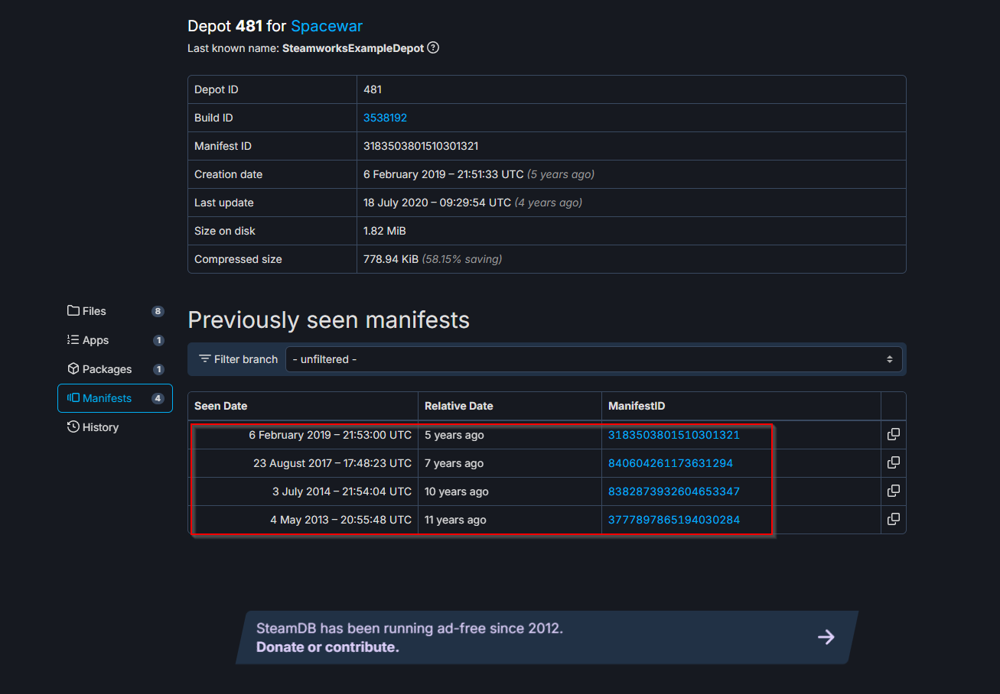

# Steam AppID downloader

This script downloads all versions release for a specific AppID on Steam.

## Setup

1. Install [Python 3.x](https://www.python.org/downloads/)
2. Download [DepotDownloader](https://github.com/SteamRE/DepotDownloader/releases/latest)
3. Go to [SteamDB](https://steamdb.info/depot/481/manifests/) and copy the manifest box content into [manifests.txt](./src/manifests.txt) (delete the dummy content from **manifests.txt**!)

4. Fill out the **manifest-dl-config.txt**
5. `python manifest-dl.py`

## Config settings

### Comment lines:

- `#` character could be used to comment lines.

### Requirement:

- `path_to_bin` - path to *DepotDownloader* executable
- `username` - Steam account name
- `app` - app ID
- `depot` - depot ID
- `output` - output path
- `manifests` - path to the file filled with manifest IDs

### Optional:

- `datetime_as_prefix` - if set to `on`, add datetime as prefix to manifest ID.
- `filelist` - path to the file that contains a list of files to filter (regex). 
The default filelist provided with the repository allows you to not download files with a certain extension without case sensitivity.